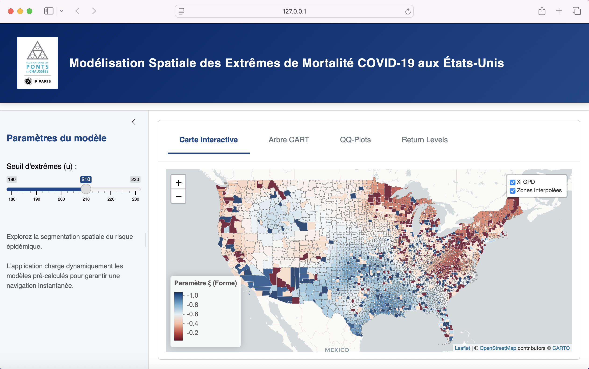

# 🧭 EVT-CART COVID-19 — Modélisation Spatiale des Extrêmes de Mortalité aux États-Unis


**École des Ponts ParisTech — Département IMI (Ingénierie Mathématique et Informatique)**
Projet de 2ème année — Année universitaire 2025/2026

---

## 📌 Résumé du projet

La communication officielle autour du COVID-19 s'est largement appuyée sur des indicateurs
*moyens* (taux de mortalité national, létalité globale...). Or, ce sont précisément les
territoires en **queue de distribution** — ceux où la mortalité dépasse très largement la
moyenne — qui concentrent l'essentiel du risque sanitaire et des besoins d'intervention.

Ce projet propose une analyse de la mortalité COVID-19 au niveau des comtés américains
**au-delà des moyennes**, en s'appuyant sur la **Théorie des Valeurs Extrêmes (EVT)** pour
caractériser statistiquement les événements les plus sévères, et sur un modèle hybride
**EVT-CART** pour expliquer l'hétérogénéité spatiale et démographique de ce risque extrême.

## 🔬 Aperçu méthodologique

### 1. Théorie des Valeurs Extrêmes — approche PoT & GPD

L'approche **Peaks over Threshold (PoT)** consiste à ne conserver que les observations
dépassant un seuil élevé `u` (ici le taux de mortalité pour 100k habitants), puis à modéliser
la loi des excès au-delà de ce seuil par une **loi de Pareto Généralisée (GPD)** :

- Le seuil `u` est choisi à l'aide d'un **Mean Residual Life (MRL) Plot**, en repérant la zone
  où l'excès moyen devient approximativement linéaire en fonction de `u`.
- Le paramètre de forme **ξ (xi)** de la GPD gouverne l'épaisseur de la queue de distribution :
  - `ξ > 0` : queue lourde (risque d'événements extrêmes très élevés, sans borne théorique) ;
  - `ξ ≈ 0` : décroissance exponentielle (queue légère) ;
  - `ξ < 0` : queue bornée.

  C'est ce paramètre qui sert d'indicateur central de sévérité du risque extrême dans tout le
  projet.

### 2. Modèle hybride EVT-CART (Generalized Pareto Regression Trees)

Plutôt que d'ajuster une GPD unique sur l'ensemble du territoire (hypothèse peu réaliste vu
l'hétérogénéité démographique et géographique des États-Unis), le projet implémente un
**arbre de régression sur mesure** (`rpart` avec fonctions `split`/`eval`/`init` custom,
cf. [R/02_evt_cart_tree.R](R/02_evt_cart_tree.R)) qui :

1. partitionne récursivement les comtés extrêmes selon des covariables démographiques
   (âge médian, revenu médian, densité de population, part d'hommes, part de 65 ans et plus)
   et géographiques (longitude, latitude) ;
2. ajuste, à chaque nœud candidat, une **GPD par maximum de vraisemblance** (package `POT`) ;
3. retient le split qui maximise le gain de log-vraisemblance entre le nœud parent et ses
   deux enfants.

Chaque feuille de l'arbre fournit ainsi un couple de paramètres GPD `(ξ, σ)` propre à un
groupe homogène de comtés.

### 3. Spatialisation par Krigeage Ordinaire

Les comtés absents du jeu de données modélisé (données manquantes ou insuffisantes) sont
complétés par **krigeage ordinaire** (package `gstat`) des paramètres `ξ` et `σ` estimés par
l'arbre, avec ajustement d'un variogramme sphérique en projection Albers Equal Area, afin
d'obtenir une carte de risque continue sur l'ensemble du territoire continental.

## 🖥️ Aperçu de la WebApp Shiny

L'application interactive ([app/app.R](app/app.R)) permet d'explorer dynamiquement les
résultats du modèle EVT-CART pour plusieurs valeurs du seuil `u` (180 à 230 décès/100k),
grâce à des résultats **entièrement pré-calculés** ([R/01_precompute.R](R/01_precompute.R))
pour garantir une navigation instantanée, sans recalcul à la volée.

**Fonctionnalités :**
- 🗺️ **Carte interactive** (Leaflet) du paramètre de forme ξ par comté, avec distinction
  visuelle entre comtés classifiés par l'arbre et comtés interpolés par krigeage ;
- 🌳 **Visualisation de l'arbre EVT-CART** avec paramètres GPD par feuille ;
- 📊 **QQ-plots** de diagnostic de l'ajustement GPD par feuille ;
- 📈 **Return levels** (niveaux de retour) par feuille, sur plusieurs horizons T.



La carte utilise `leafletProxy` pour ne redessiner que les polygones lors d'un changement de
seuil `u`, sans recharger le fond de carte — la navigation reste fluide même sur de grands
volumes de comtés.

## 📁 Structure du dépôt

```
evt-cart-covid19-usa/
├── README.md                    # Ce fichier
├── .gitignore                   # Fichiers ignorés (R, Shiny, LaTeX, données brutes)
├── app/                         # Application Shiny
│   ├── app.R                    # Application principale
│   └── www/                     # Assets (police, logo)
├── data/
│   ├── raw/                     # Shapefiles US Census (comtés / états)
│   └── processed/                # Dataset modélisé + résultats pré-calculés (.rds)
├── R/                            # Scripts d'analyse et de modélisation
│   ├── 01_precompute.R           # Pré-calcul EVT-CART + krigeage pour la WebApp
│   ├── 02_evt_cart_tree.R        # Construction et diagnostic de l'arbre EVT-CART
│   └── 03_tree_vis.R             # Visualisation colorée de l'arbre (u = 210)
└── docs/                         # Livrables
    ├── rapport_final.pdf         # Rapport de projet complet
    ├── presentation.pdf          # Slides de la soutenance
    └── latex/                    # Sources LaTeX des deux documents
```

> ℹ️ Les fichiers CSV bruts de surveillance COVID-19 (CDC, plusieurs centaines de Mo) ne sont
> pas versionnés dans ce dépôt. Ils sont disponibles publiquement sur
> [data.cdc.gov](https://data.cdc.gov) (jeu de données *COVID-19 Case Surveillance Public Use
> Data with Geography*). Le fichier `data/processed/df_final.csv` correspond au jeu de données
> déjà agrégé par comté (démographie + mortalité) utilisé en entrée des scripts `R/`.

## ▶️ Instructions d'exécution

### Prérequis

```bash
Rscript -e 'install.packages(c("data.table","sf","rpart","partykit","gstat","sp","dplyr",
  "POT","ggplot2","patchwork","rpart.plot","shiny","bslib","shinyWidgets","leaflet",
  "RColorBrewer","htmltools","tidycensus"))'
```

### Lancer la WebApp (résultats déjà pré-calculés)

```bash
Rscript -e 'shiny::runApp("app")'
```

### Reproduire les pré-calculs à partir des données

```bash
# Depuis la racine du dépôt
Rscript R/01_precompute.R      # régénère data/processed/precomputed_results.rds
Rscript R/02_evt_cart_tree.R   # arbre EVT-CART détaillé + diagnostics pour u = 210
Rscript R/03_tree_vis.R        # rendu graphique coloré de l'arbre
```

## 👥 Auteurs

Projet réalisé par **Eliott Delhaye**, **Chloé Spittael**, **Camille Viénot** et
**Paul-Émile Marcus**, élèves de 2ème année à l'École des Ponts ParisTech, département IMI.
